# Object Orientation \[ Lynda \]
# How to design a **class** ?

## Structure of a class

A class has 3 things :

-   **name** : it is the name of the
    class. **For eg: **BankAccount, File, Document etc
-   **attributes**: it is about what
    identities would represent this class ? **For eg:** name, color,
    size, length, FileType etc
-   **behavior: **it is about what can
    this class perform ? **For eg: **save(), store(), deposit(),
    withdraw() etc

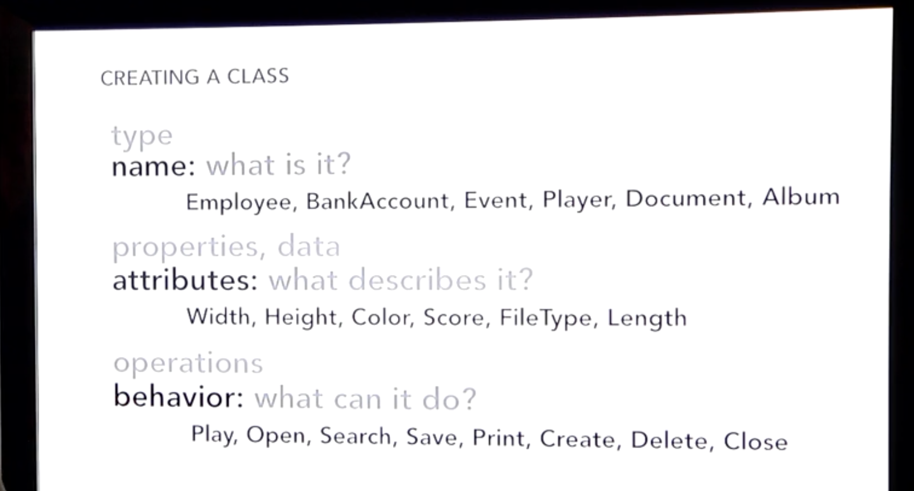 

## Fundamental features of a class

There are **four** fundamental features
for a class which is acronymned as **A
PIE**

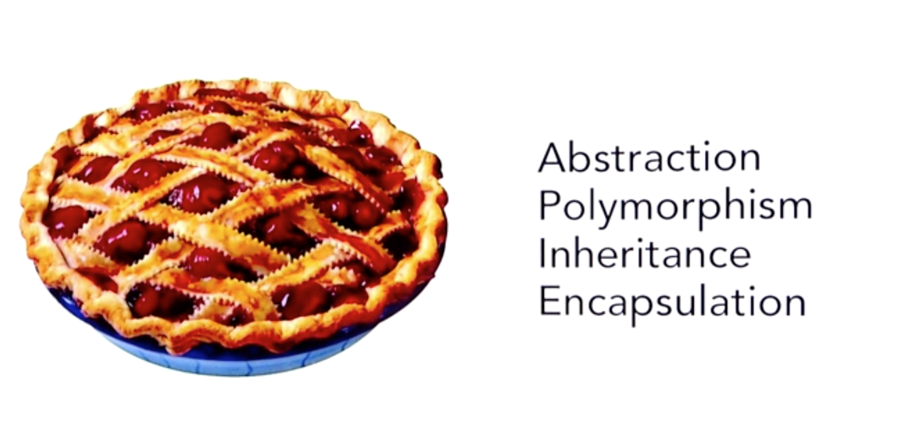 

### Abstraction

 

In this stage of **abstraction** you would identify **what attributes and behaviors** needs to be
inside a class.

Thus, abstraction is about modeling the formation of a class.

### Encapsulation

In this stage you would be doing **information
hiding**.

Encapsulation is **hiding of both attributes and
behaviors** of a class from the reach of external world. Early
days I misunderstood this concept as a way of keeping secret. Actually,
the concept of encapsulation is to avoid the external dependencies as
much as possible, and thereby make a class easy to refactor (evolve). 

For example,

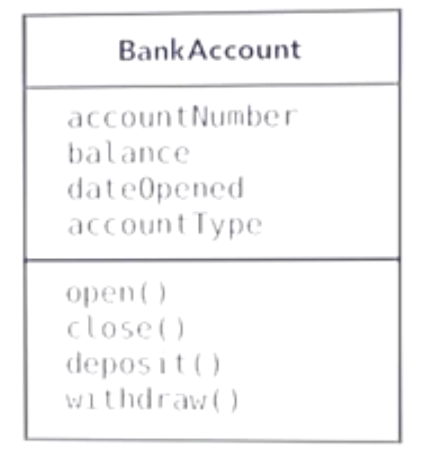 

In this *BankAccount* class, imagine you had made the *balance*
attribute public. It leads to other parts of program referring to the
*balance* attribute directly without invoking *deposit()* or
*withdraw()* behaviors. It make the implementation very much tightly
coupled. So you don't have a control over how the balance is updated.
Other parts of program can simply directly access the *balance* and
tweak it. Even if you change the logic of *withdrawal* from one way to
other, nobody cares as *balance* is directly accessible to the world. 

Most important rule of encapsulation is to **hide everything in a class except those which needs
to be explicitly directly accessed by world**.

In other words encapsulation is synonymous to **black** **boxing,** where you would see only the
particular input/output sockets placed outside the box. You don't have
any clue on the intrinsic working of this black box.

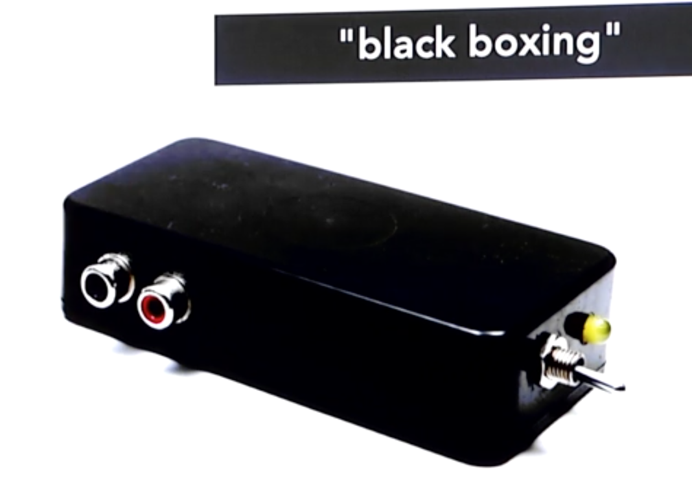 

### Inheritance

Imagine you have abstracted a *Person *class for your program (during
any of analysis or design or coding phase) as below :

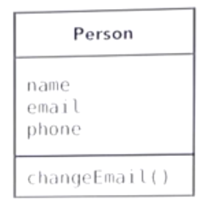 

Then came a requirement to have a *Customer* class for your program
which would like :

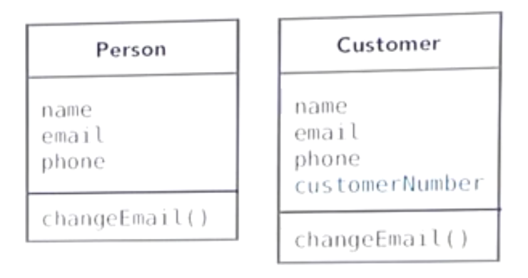 

You figured that almost every attributes & behaviors of *Person* class
is duplicated in *Customer* class except for the *customerNumber*
attribute. Hence, you decided to base the *Customer* class upon the
*Person* class, which is called **inheritance**.

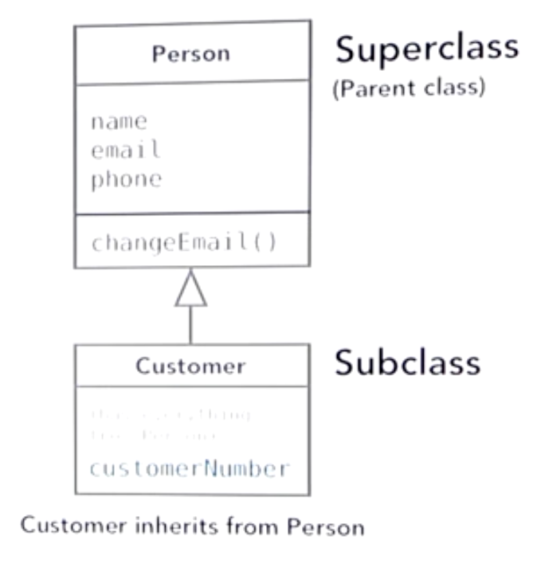 

As you have already abstracted the **essential
commonalities**** **into *Person* class, it is useful to setup
inheritance for an other similar class name *Employee* from *Person,* as
follows *:*

*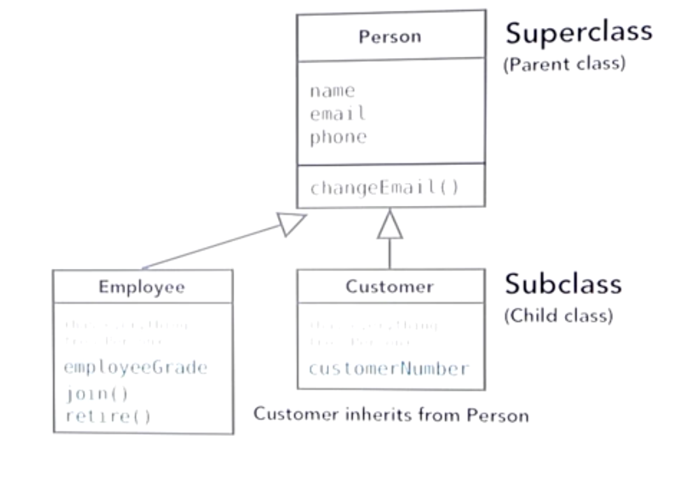 *

The **main advantage of inheritance** is
not just that we could reuse codes as much as possible, but **polymorphism**

### Polymorphism

It is the ability to perform the right behavior for the circumstances. 

For example, take the behavior of **operator + :**

-   "hello" + "world" = "helloworld"
-   5 + 10 = 15

Mostly every programming languages are provided with this support of
concatenation which works based on the circumstances. This is the built
in polymorphism in OOP languages. Also, we can make our own polymorphism
into action.

## Identification of a class

How to identify **classes**/**objects** in OOA phase ?

-   **noun:** If the thing under
    discussion is a **noun **then it could be an object. **For
    eg: **a place, a person, a thing etc
    -   In simpler terms if you can put **'the'** before anything, then
        it could be an object. **For eg: **the apple, the bridge, the
        time, the date etc.
-   **verb:** A verb could be a behavior
    of an object. **For eg: **an explosion, saving, storing, digestion,
    run etc

# Defining Requirements

Technically in the requirements analysis stage we are not doing anything
object oriented, but we certainly describe the requirements either
formally or informally so that the next phase becomes easier, which is
OOA. While gathering requirements you have to consider **functional** and **non-functional** requirements.

## Functional requirements

{.expand-control-image}What are
functional requirements ?

In this stage you describe what the **application "must" do**. It captures the
**Features** / **Capabilities** of the application.These requirements
are written in **"must" **have phrases like :

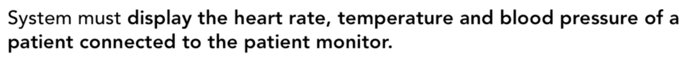 

 

 

 

 

Example of a complex functional requirement :

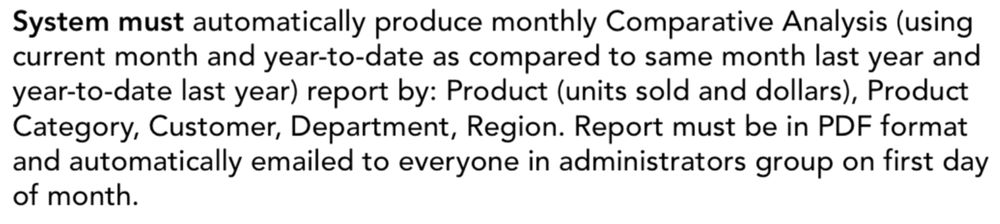 

## Non-Functional requirements

{.expand-control-image}What are
non-functional requirements ?

The non-functional requirements are not capabilities or features, but
they are some rules or notion supposed to be followed.

Some common non-functional requirements are :

-   **Help -** Documentation or help needed for reference by the
    application users.
-   **Legal - **Does this application pass the legal requirements
    (medical regulations of such apps, privacy constraints of social
    networking apps etc)
-   **Performance - **How many users should the backend application
    support simultaneously
-   **Support - **If there comes an issue in the morning 2 AM, who will
    be there to do the support on application. (Customer care ?, GNC,
    TMM etc)
-   **Security - **It can be a feature or non-functional requirement
    depending on the application type. 

Some examples of non-functional requirements look like :

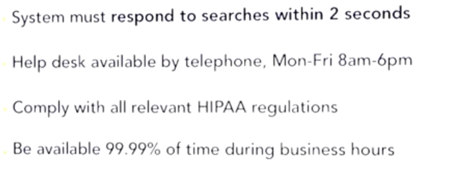 

FURPS or FURPS+ is like a common checklist to look into while defining
requirements. It reminds us whether we have defined functional
requirements, have we thought in usability perspective, did we thought
about performance concerns etc.

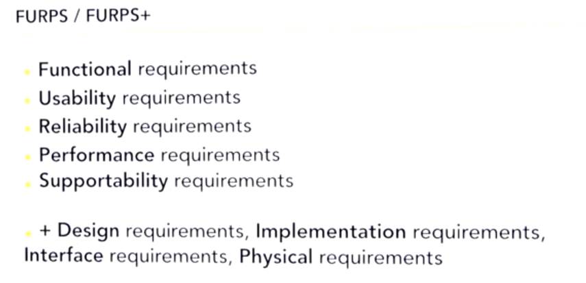 

FURPS+ suggests that whether you have covered the :

-   **Functional requirements - **Features of the application are mapped
    ?
-   **Usability **requirements** - **Documentation, guide, tutorials etc
    are prepared ?
-   **Reliability **requirements** - **Have you laid out the Disaster
    Recovery, Failover plans ?
-   **Performance **requirements** - **What is the scalability
    requirement of application. How many simultaneous users are expected
    to be supported ?
-   **Supportability **requirements** - **Who will maintain the
    application ? Does it need internationalization ? etc
-   \+
    -   **Design requirements - **The design constraints such as it
        should be an iPhone app, hybrid app etc
    -   **Implementation requirements -** What language or environment
        in which the system is expected to run.
    -   **Interface requirements -** Do we have to comply with the
        external interface ? Or should it be REST based etc. 
    -   **Physical requirements -** Should this app be running on a
        phone with camera etc

At the end of requirements analysis phase, you would have a
documentation describing the functional and non-functional requirements
of the application as defined above. This will be the input for next
stage in software development, which is analysis - OOA.

# Object Oriented Analysis

So far we have documented the requirements in terms of what the **application "must" do**. Now, its time for
figuring out **how a user would achieve that
goal by using our application****.** There are two common
procedures used in OOA phase - **use
cases** & **user stories**. Both
of them are certain descriptions written in plain non technical words
about how would you use the application to perform something. It can be
represented completely in written textual form. And, you may use
diagrams if you think diagrams could support in understanding the system
better. You can use either *use case* or *user story* or both depending
on whether you follow agile scrum or rational unified method or so on

## Use Case

For writing a use case, there are very well established templates in pdf
or word format. You just need to fill in the templates. But, it could be
an overkill sometimes as such a formal format covers a hell lot of
details. So typically a Use Case needs bare minimum of 3 essential
points - **Title, Actor & Scenario.**

### Structure of a Use Case

#### Title

**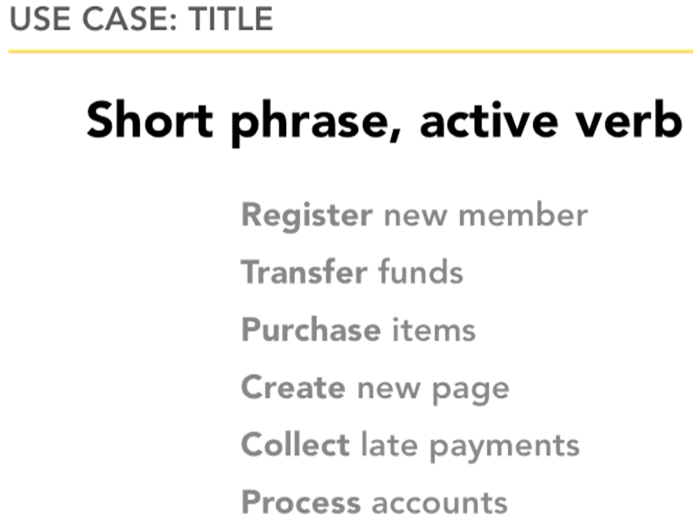 **

#### Actor

Actors are external entities that use our application to achieve certain
goals. It is important to remember that actors are external to the
application. It could be :

-   a specific role of a user such as administrator, member, guest
-   designation such as executive role, data entry staff
-   functions such as customer, customer care staff
-   abstract roles like requestor/approver
-   external systems such as data sources, web services, other apps,
    backup systems, some machines and so on.

To reduce complexity of use cases you can replace a complex scenario
with an actor.

A primary actor is one who
requests/initiates action, and all others are secondary actors.

#### Scenario

-   A **scenario is an actor's
    goal** that is achieved from our application in a single
    encounter. 
-   Sometimes, a use case would include multiple scenarios like the
    *Purchase items* scenario below. 
-   To get a hint on what can be considered a scenario, take for example
    the title "log into application". This can't be a meaningful
    scenario because, the goal of user is not specified here. Why do you
    log into the application is not clear. Hence, this is just a part of
    the scenario, but not a scenario in itself.

 

Examples of scenario:

** **

** **

**   
**

### Diagramming use cases

-   A use case diagram fits several use cases in a single diagram,
    because with use case diagramming we are trying to visualize all the
    use cases together to see system functions altogether.
-   Use case diagrams are only just a support for the written
    descriptions. It is no way a replacement for use case description.
-   In the diagram below :
    -   The central box indicates the application. Anything outside the
        box is external to the application
    -   Use cases of the application is written inside ellipses.
    -   Primary actors are usually depicted towards the left of the
        application.
    -   Actors are represented using stick figures. But, if the actor is
        not human, you could put them in a box with *angle quotes* to
        denote it as an actor. for eg: *Analytics System* in the diagram

 

## User Story

A *user story* is similar to *use case *but written in a very simply
sentence. Like use case there is a particular format for user story.
User stories are most convenient in agile or extreme programming, where
one or more user stories needs to be finished within a sprint.

Template :

 

  

Examples :

 

 

 

 

  

Compare use case vs user story :

 

## Conceptual Modeling

Conceptual modeling is object oriented construction of a model of the
software. It involves the following steps:

1.  Collect together all the **user
    stories** and **use
    cases** defined so far, and scan the written descriptions to
    identify **nouns** and make a list of nouns.
2.  Nouns are potential objects. **Filter the list** of nouns by
    eliminating duplicates and irrelevant ones.
3.  **Box** the nouns.
4.  **Connect** related boxes. **Tag** the relationship. Specify the
    **multiplicity** if needed.
5.  **Identify responsibilities** of different objects by **marking
    verbs** from the **user stories** and
    **use cases**. This helps to
    distribute responsibilities between different objects rather than
    accumulating a lot of responsibilities unnecessarily towards *actor*
    objects like *customer*.
    -   Sometimes people make mistake by identifying responsibilities as
        to be in *Actor* side. To handle such situations ask the
        question yourself *"In which object should a responsibility
        behavior live in ?"*
        1.  Eg 1: the behavior "check order status" sounds like a
            responsibility of *Customer*. But, this is supposed to be
            implemented in the *Order* object simply because this
            behavior is better to live in *Order* object.
        2.  Eg 2: the behavior "verify items in cart" again sounds like
            responsibility of Customer. But, it is better to be
            implemented in the *Order* object as "Display totals" as it
            serves the goal.

  

 

 

 

 

 

 

 

 

## CRC Cards

CRC (Class - Responsibility - Collaborators) is an alternate way for
modeling objects.

Each card indicates an object, with class name on top, responsibilities
marked on left and collaborator objects in the right.

        Format of a CRC card looks like :

 

Each CRC card represents a class like the following :

 

Once all the CRC cards are laid out. It helps you to see which classes
relates each other and organize CRC cards accordingly.

 

# Object Oriented Design

## Class Diagrams

After having created the conceptual model
or the CRC cards, you can start
diagramming classes. The class diagram doesn't need to depict every
possible *attributes* and *behaviors. *Instead, you need to show only
the relevant details. It represents ***Visibility** (- private* and *+
public), **Data type** (of attributes, behavior parameters, behavior
return data), **Static** (*underlined *attributes* and *behaviors),*
**Constructor** *.*

* *

** **

### Inheritance

Inheritance is easily identifiable by the **"****IS A****"** relationship. Once you have
charted the conceptual model, it would
speak for itself there appears "IS A" relationship between certain
classes. They fall under the inheritance relationship. The inheritance
relationship can be called by different terms : 

parent class → child class

base class   → derived class

super class  → sub class

abstract class → concrete class

  

-   The natural language has the best representation of "IS A"
    relationship as seen below.

  

  

-   Inspect the classes identified during OOA phase to figure out the
    inheritance relationship among them. Here, *Checking Account *is a
    *Bank Account*.

  
   
  

-   *Savings Account *is a *Bank Account*  
    *  
    *

 

-   Inheritance is represented using an arrow with wedge.  
      

 

-   You can write specific *attributes* and *behaviors *into the
    *sub-classes* or *override* existing ones  
      

 

### Abstract Class

There are cases when you don't want to instantiate a class (for eg:
*BankAccount*) simply because there doesn't exist a plain *BankAccount*.
It makes sense to exist only the right form of *BankAccount* such as
*CheckingAccount, SavingsAccount, InvestmentAccount* etc. As in the
above example *BankAccount *can be an abstract
class which cannot be instantiated but hold the attributes and
function definitions - usable only when they gets inherited.

### Interface

Implementing an Interface is like we are signing a contract. It is best
to program application using interfaces more often than inheritance.

For eg: Let's assume you are going to make several classes which are
supposed to be printable (means it should have method `print()` ). Then
you should implement every class with the *Printable* interface, where
*Printable *is the class where we define the `print()` method.

 

 

 

 

### Association

Association is a generic term indicating that an object is related with another object (aggregation,
composition etc). **Aggregation** &
**Composition** are two types of
associations in OOP. 

Aggregation is similar to Composition as both indicates a "HAS A"
relationship. But, in composition, when the owning object is destroyed
the owned objects also gets destroyed. For eg: A *document *object owns
*page* objects, and when *document* object is destroyed, the *page*
objects also gets destroyed. So, in composition the object lifetime of
owned object is dependent on the owner object.

 

 

 

Open diamond indicates *aggregation*.

Closed diamond indicates *composition*.

## UML Diagrams

There are **14 types** **of UML diagrams.** But, rarely do we need more
than a few like *Use Case Diagram, Class Diagram, Sequence Diagram* and
sometimes *State Machine Diagram*. Like in any other stages of OOA, the
necessity of drawing UML also premises on the need. They are required
only If some of them are essential to understand the application.

 

## Design Patterns

When you have clarity on the classes needed for the application, and the
sequence of operations between objects. It is time to refine the current
design of application based on the already well known designs patterns
of software development. There are **23 design patterns** so far**.**

 

# Object Oriented Design Principles

## General Design Principles

### DRY

Don't Repeat Yourself.

### YAGNI 

You Ain't Gonna Need It.

Eg: If your software need to create a database abstraction, you don't
need to consider every database providers other than what is currently
in use.

### KISS 

Keep It Simple, Stupid

Eg: When an aircraft is designed, a jet aircraft is to be maintainable
with the common simple tools so that any average mechanic could fix it
during war combat maintenance. Likewise, the software applications must
not be crafted in complex way. 

Eg: If your software needs to import excel document, keep it simple by
importing just a csv so that you don't need to code for processing excel
formatting, graphs, error handling etc.

 

## SOLID

 

 

 

 

 

  

<table>
<tbody>
<tr class="odd">
<td>

</td>
<td>

</td>
<td>

</td>
</tr>
</tbody>
</table>

## GRASP

  

 

 

 

 

 

  

  

 

 

# Further Reference

 

\`     
