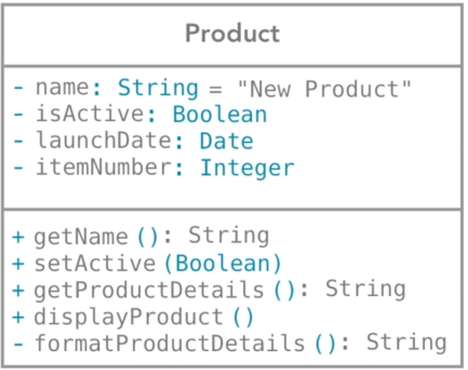
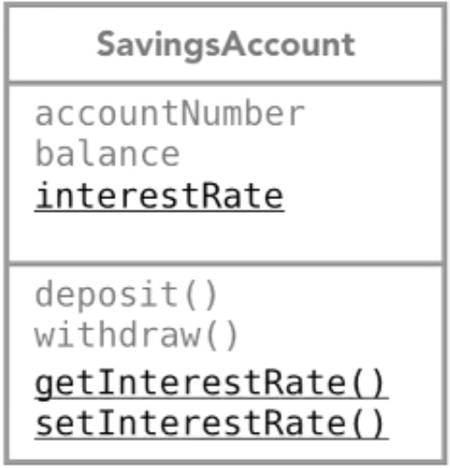

# Object Oriented Design

## Class Diagrams

After having created the **Conceptual Object Model**, you can start
diagramming classes. The class diagram doesn't need to depict every
possible *attributes* and *behaviors*. Instead, you need to show only
the relevant details. It represents :

- **Visibility** (_- private and + public_)
- **Data type** (_of attributes, behavior parameters, behavior return data_)
- **Static** (_attributes and behaviors_)
- **Constructor**

|**Class Diagram with Visibility**     |
|-----------------------------|
|**Class Diagram with Static Members**     |

## Inheritance

Inheritance is easily identifiable through **IS A** relationship. Once you have
charted the **Conceptual Object Model**, _"IS A"_ relationship between
classes becomes evident. The inheritance
relationship can be called by different terms : 

- parent class → child class
- base class   → derived class
- super class  → sub class
- abstract class → concrete class

|Illustration of Inheritance through **IS A** relationship|
|----------------------------------------------------------|
|The natural language has the best representation of "IS A" relationship as seen below.   |
|Inspect the classes identified during OOA phase to figure out the inheritance relationship among them. Here, _Checking Account_ **is a** _Bank Account_.   |
|_Savings Account_ **is a** _Bank Account_.    |
|Inheritance is represented using an arrow with wedge.   |
|You can write specific *attributes* and *behaviors* into the *sub-classes* or *override* existing ones.   |

### Abstract Class

There are cases when you don't want to instantiate a class (for eg:
*BankAccount*) simply because there doesn't exist a plain *BankAccount*.
It makes sense to exist only the right form of *BankAccount* such as
*CheckingAccount, SavingsAccount, InvestmentAccount* etc. As in the
above example *BankAccount *can be an abstract
class which cannot be instantiated but hold the attributes and
function definitions - usable only when they gets inherited.

### Interface

Implementing an Interface is like we are signing a contract. It is best
to program application using interfaces more often than inheritance.

For eg: Let's assume you are going to make several classes which are
supposed to be printable (means it should have method `print()` ). Then
you should implement every class with the *Printable* interface, where
*Printable *is the class where we define the `print()` method.

 

 

 

 

### Association

Association is a generic term indicating that an object is related with another object (aggregation,
composition etc). **Aggregation** &
**Composition** are two types of
associations in OOP. 

Aggregation is similar to Composition as both indicates a "HAS A"
relationship. But, in composition, when the owning object is destroyed
the owned objects also gets destroyed. For eg: A *document *object owns
*page* objects, and when *document* object is destroyed, the *page*
objects also gets destroyed. So, in composition the object lifetime of
owned object is dependent on the owner object.

 

 

 

Open diamond indicates *aggregation*.

Closed diamond indicates *composition*.

## UML Diagrams

There are **14 types** **of UML diagrams.** But, rarely do we need more
than a few like *Use Case Diagram, Class Diagram, Sequence Diagram* and
sometimes *State Machine Diagram*. Like in any other stages of OOA, the
necessity of drawing UML also premises on the need. They are required
only If some of them are essential to understand the application.

 

## Design Patterns

When you have clarity on the classes needed for the application, and the
sequence of operations between objects. It is time to refine the current
design of application based on the already well known designs patterns
of software development. There are **23 design patterns** so far**.**

 

# Object Oriented Design Principles

## General Design Principles

### DRY

Don't Repeat Yourself.

### YAGNI 

You Ain't Gonna Need It.

Eg: If your software need to create a database abstraction, you don't
need to consider every database providers other than what is currently
in use.

### KISS 

Keep It Simple, Stupid

Eg: When an aircraft is designed, a jet aircraft is to be maintainable
with the common simple tools so that any average mechanic could fix it
during war combat maintenance. Likewise, the software applications must
not be crafted in complex way. 

Eg: If your software needs to import excel document, keep it simple by
importing just a csv so that you don't need to code for processing excel
formatting, graphs, error handling etc.

 

## SOLID

 

 

 

 

 

  

<table>
<tbody>
<tr class="odd">
<td>

</td>
<td>

</td>
<td>

</td>
</tr>
</tbody>
</table>

## GRASP

  

 

 

 

 

 

  

  

 

 

# Further Reference

 

\`     
